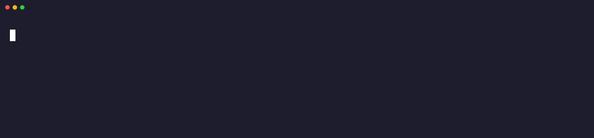
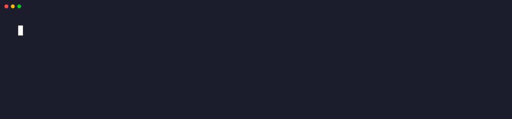

# Themes

Four bundled themes. Each one adapts all 11 segments, 3 model tiers, 5 context gauge states, and duration escalation colors.

```sh
export CLAUDE_STATUSLINE_THEME="catppuccin-mocha"
```

> Want to create your own? See the [theme creation guide](CONTRIBUTING.md#adding-a-theme) or [port your existing terminal theme](CONTRIBUTING.md#porting-an-existing-terminal-theme).

---

<details open>
<summary><h2>catppuccin-mocha</h2> <code>default</code></summary>

<br>


Based on [Catppuccin Mocha](https://github.com/catppuccin/catppuccin), the highest-contrast dark flavor. Warm pastels on a deep navy background. The most popular terminal theme in open source.

```sh
export CLAUDE_STATUSLINE_THEME="catppuccin-mocha"
```

<details>
<summary>Palette</summary>

| Role | Name | 256 | Hex |
|------|------|-----|-----|
| Background | Base | 234 | `#1e1e2e` |
| Foreground | Text | 188 | `#cdd6f4` |
| Muted BG | Surface0 | 236 | `#313244` |
| Dim BG | Mantle | 233 | `#181825` |
| Blue (Sonnet) | Blue | 111 | `#89b4fa` |
| Gold (Opus) | Yellow | 223 | `#f9e2af` |
| Green | Green | 151 | `#a6e3a1` |
| Cyan (Haiku) | Teal | 158 | `#94e2d5` |
| Red | Red | 211 | `#f38ba8` |
| Orange | Peach | 216 | `#fab387` |
| Magenta | Mauve | 183 | `#cba6f7` |
| Dim text | Overlay0 | 243 | `#6c7086` |

</details>

<details>
<summary>Overrides</summary>

| Token | Value | Why |
|-------|-------|-----|
| `C_SONNET_BG` | 69 | Deeper blue, reduces glare against navy background |
| `C_CTX_HEALTHY_BG` | 22 | Green-tinted dark instead of Surface0 for context contrast |
| `C_CTX_FILLING_BG` | 52 | Dark red tint for 70%+ context warning |
| `C_CTX_SOON_BG` | 52 | Consistent dark red for approaching compaction |
| `C_CTX_CRIT_BG` | 52 | Consistent dark red for critical state |

</details>

</details>

---

<details>
<summary><h2>dracula</h2></summary>

<br>



Based on [Dracula](https://draculatheme.com). High contrast with vivid neon accents on a cool dark background. No overrides needed: the Dracula palette maps cleanly to all semantic tokens.

```sh
export CLAUDE_STATUSLINE_THEME="dracula"
```

<details>
<summary>Palette</summary>

| Role | Name | 256 | Hex |
|------|------|-----|-----|
| Background | Background | 236 | `#282a36` |
| Foreground | Foreground | 255 | `#f8f8f2` |
| Muted BG | Current Line | 238 | `#44475a` |
| Dim BG | darker | 234 | `#21222c` |
| Blue (Sonnet) | Purple | 141 | `#bd93f9` |
| Gold (Opus) | Yellow | 228 | `#f1fa8c` |
| Green | Green | 84 | `#50fa7b` |
| Cyan (Haiku) | Cyan | 117 | `#8be9fd` |
| Red | Red | 203 | `#ff5555` |
| Orange | Orange | 215 | `#ffb86c` |
| Magenta | Pink | 212 | `#ff79c6` |
| Dim text | Comment | 61 | `#6272a4` |

</details>

<details>
<summary>Overrides</summary>

None. Pure Dracula derivation - all semantic tokens work well with the default mapping.

</details>

</details>

---

<details>
<summary><h2>nord</h2></summary>

<br>



Based on [Nord](https://www.nordtheme.com). Muted arctic tones inspired by the polar night and aurora borealis. Lower contrast by design for a calm, focused aesthetic.

```sh
export CLAUDE_STATUSLINE_THEME="nord"
```

<details>
<summary>Palette</summary>

| Role | Name | 256 | Hex |
|------|------|-----|-----|
| Background | Polar Night | 236 | `#2e3440` |
| Foreground | Snow Storm | 255 | `#eceff4` |
| Muted BG | Polar Night | 238 | `#3b4252` |
| Dim BG | Polar Night | 235 | `#2e3440` |
| Blue (Sonnet) | Frost | 110 | `#81a1c1` |
| Gold (Opus) | Aurora | 222 | `#ebcb8b` |
| Green | Aurora | 144 | `#a3be8c` |
| Cyan (Haiku) | Frost | 116 | `#88c0d0` |
| Red | Aurora | 167 | `#bf616a` |
| Orange | Aurora | 173 | `#d08770` |
| Magenta | Aurora | 139 | `#b48ead` |
| Dim text | Polar Night | 240 | `#4c566a` |

</details>

<details>
<summary>Overrides</summary>

| Token | Value | Why |
|-------|-------|-----|
| `C_CTX_HEALTHY_BG` | 23 | Teal-tinted dark for readable healthy context gauge against Nord's muted tones |

</details>

</details>

---

<details>
<summary><h2>bluloco-dark</h2></summary>

<br>


Based on [Bluloco Dark](https://github.com/uloco/theme-bluloco-dark). Vivid accents with blue-leaning neutrals. Includes several contrast fixes for status line readability.

```sh
export CLAUDE_STATUSLINE_THEME="bluloco-dark"
```

<details>
<summary>Palette</summary>

| Role | Name | 256 | Hex |
|------|------|-----|-----|
| Background | | 236 | `#282c34` |
| Foreground | | 249 | `#abb2bf` |
| Muted BG | | 237 | `#2c313a` |
| Dim BG | | 235 | `#262626` |
| Blue (Sonnet) | | 33 | `#3691ff` |
| Gold (Opus) | | 221 | `#f9c859` |
| Green | | 77 | `#3fc56b` |
| Cyan (Haiku) | | 80 | `#34bfd0` |
| Red | | 204 | `#ff6480` |
| Orange | | 209 | `#ff7b72` |
| Magenta | | 134 | `#b267e6` |
| Dim text | | 246 | `#636d83` |

</details>

<details>
<summary>Overrides</summary>

| Token | Value | Why |
|-------|-------|-----|
| `C_SONNET_BG` | 27 | Deeper blue, original 33 is too bright for a BG |
| `C_CTX_WARMING_BG` | 236 | Uses base BG instead of olive: gold FG carries the signal alone |
| `C_CTX_FILLING_BG` | 52 | Dark red so orange FG pops on filling context |
| `C_DUR_LOW` | 247 | Dim text bumped for readability on dim BG |

</details>

</details>

---

## How themes work

The theme system is a two-layer architecture:

1. **Theme files** (`lib/themes/*.sh`) define 12 `PALETTE_*` base colors
2. **Derivation** (`lib/derive.sh`) maps those 12 colors into ~30 `C_*` semantic tokens

Themes can override any `C_*` token directly for fine-tuning. The derivation uses `${VAR:-default}`, so anything set in the theme file takes priority over the derived value.

This means creating a basic theme requires just 12 variables. The derivation handles model colors, context gauge states, duration escalation, git indicators, and everything else automatically.

See [Adding a Theme](CONTRIBUTING.md#adding-a-theme) for the full guide, including how to port your existing terminal color scheme.
